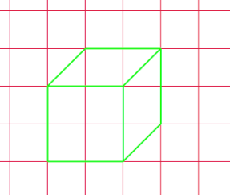

# Assignment: Lined cube

*PLEASE READ THIS **ENTIRE** DOCUMENT FIRST*

* [the assignment](#the-assignment)
* [submitting-your-work](#submitting-your-work)

## The assignment

Open a new file in your IDE

* Create an svg element
* Make sure to add the xmlns="http://www.w3.org/2000/svg" tag
* Create a viewBox of 1000x1000 in that svg element at x 0, y 0
* Draw a grid of 10x10 lines
* Save the svg element as an svg file and call it grid.svg
* Create a html file with an svg element in it and use your grid.svg as background for it
* Using lines, draw a cube and align it with the grid

Tip: Remeber that the width of the line takes up coordinate space too.

## Submitting your work
Create a new branch called **gh-pages** and upload your local work into this branch. Submit a new **pull request** and make sure to put the (working) **GitHub Pages URL** in the comment section. 
